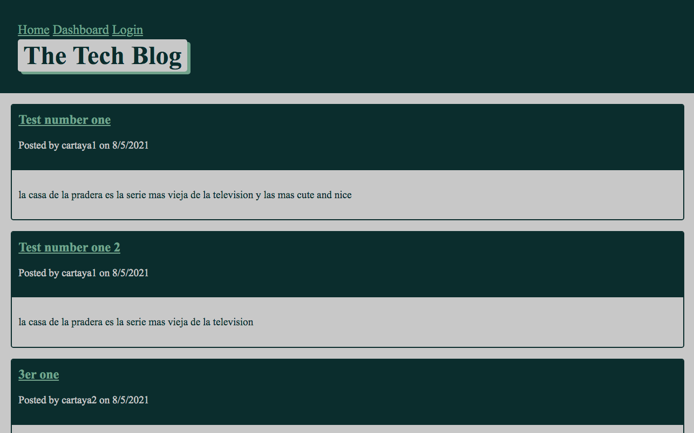

<h1 align="center">Model-View-Controller (MVC) Tech Blog 👋</h1>
  
<p align="center">
    
    
    
    
    <a href="https://github.com/cartaya1"></a>
    <a href="https://twitter.com/cartayas_USA">
        
    </a>
</p>
  
<p align="center">
    
    
    
    
    
    
</p>
   
## Description

🔍 A mysql database and CMS-style Blog built using Model View Controller (MVC) paradigm. Built using MySQL2, Express, Sequelize, Bulma, Handlebars and dotenv.

🔍 Una base de datos mysql y un blog estilo CMS construido usando el paradigma Model View Controller (MVC). Construido con MySQL2, Express, Sequelize, Bulma, Handlebars y dotenv

*[Deployed Application](https://cartaya1-tech-blog.herokuapp.com/)**
  
💻 Below is a screenshot of the application:
  


# User Story

```
AS A developer who writes about tech
I WANT a CMS-style blog site
SO THAT I can publish articles, blogs,thoughts, and opinions

COMO desarrollador que escribe sobre tecnología
QUIERO un sitio de blogs estilo CMS
PARA QUE pueda publicar artículos, blogs, pensamientos y opiniones
```

# Table of Contents
- [Description](#description)
- [User Story](#user-story)
- [Table of Contents](#table-of-contents)
- [Installation](#installation)
- [Usage](#usage)
- [Testing](#testing)
- [Contributing](#contributing)
- [Questions](#questions)

# Installation
💾   
  
`npm init`

`npm install`
  
# Usage
💻   
  
Run the following command at the root of your project and answer the prompted questions:

`mysql -u root -p`

Enter PW when promted

`source db/schema.sql`

`quit`

`npm run seed`
  
`npm start`

With Nodemon:

`npm run watch`

# Testing
✏️

Helper testing is currently setup with Jest

# Contributing
[Luis Cartaya](https://github.com/cartaya1)

# Questions
✉️ Contact me with any questions: [email](mailto:cartaya1@msn.com) , 
[GitHub](https://github.com/cartaya1)<br />
